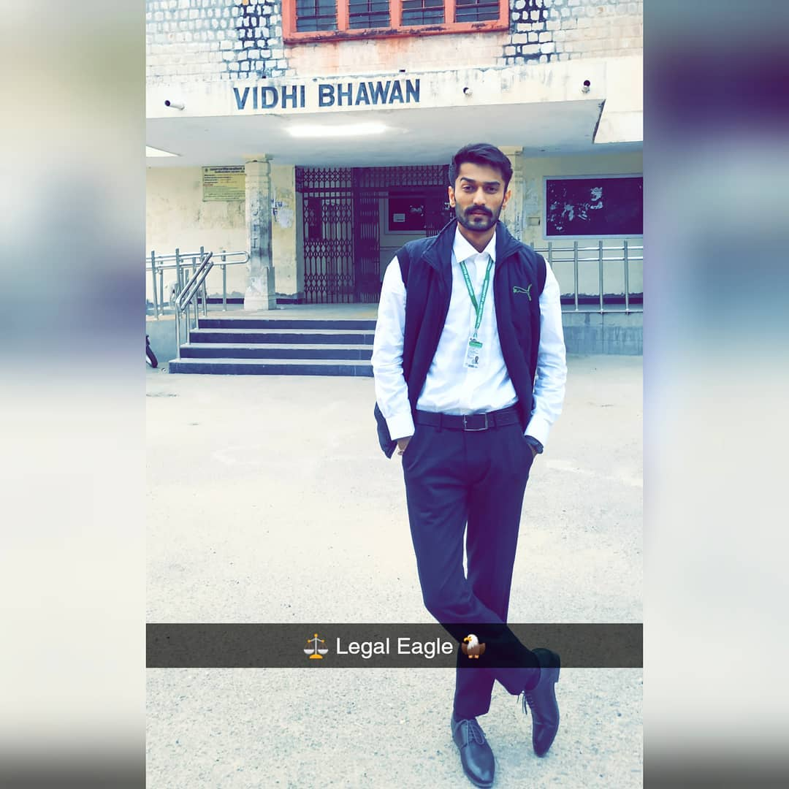
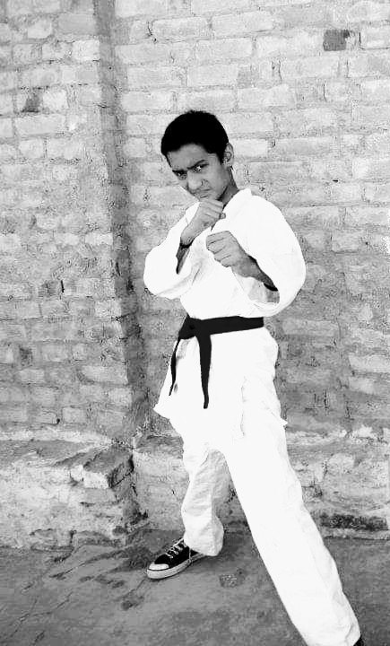
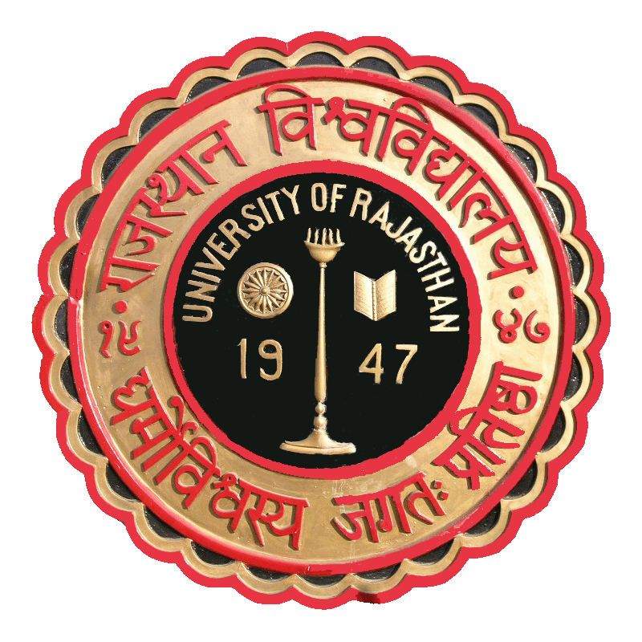

# ABOUT
<html>
<body>

</body>
</html>
I was born in a city named Bikaner situated in north-western Rajasthan which is a part of the great Thar desert.
 During childhood I was excellant in martial arts, received medals in several games which exhibited my interest in sports.
<html>
<body>

</body>
</html>
 I completed my schooling from Tagore Public School, Vaishali Nagar, Jaipur in science stream.After which I changed my stream to Humanities as according to my interest and goal to serve the society and make reforms for public welfare.
 In graduation, my disciplines were History, Geography and Economics.
When I was in final year of my graduation I studied Modern Indian History as my one of subject, from there I got know that how law is the mechanism on which state machinery works either efficiently or inefficiently. which may result into good governance or bad governance and can change the country's future, this enunciated my interest in Law and I cracked the University Law Entrance Test(ULET) for University Of Rajasthan<html>

<body>

</body>

</html>.
# CONTACT
<html lang="en">
<head>
</head>
<body>
 <!-- Text link tag - by Facebook -->
 <a href="https://www.facebook.com/surajshrimali12/">Facebook</a>
</body>
</html>

 
<html lang="en">
<head>
</head>
<body>
 <!-- Text link tag - by Facebook -->
 <a href="https://www.instagram.com/suraj_shrimali_/">Instagarm</a>
</body>
</html>
